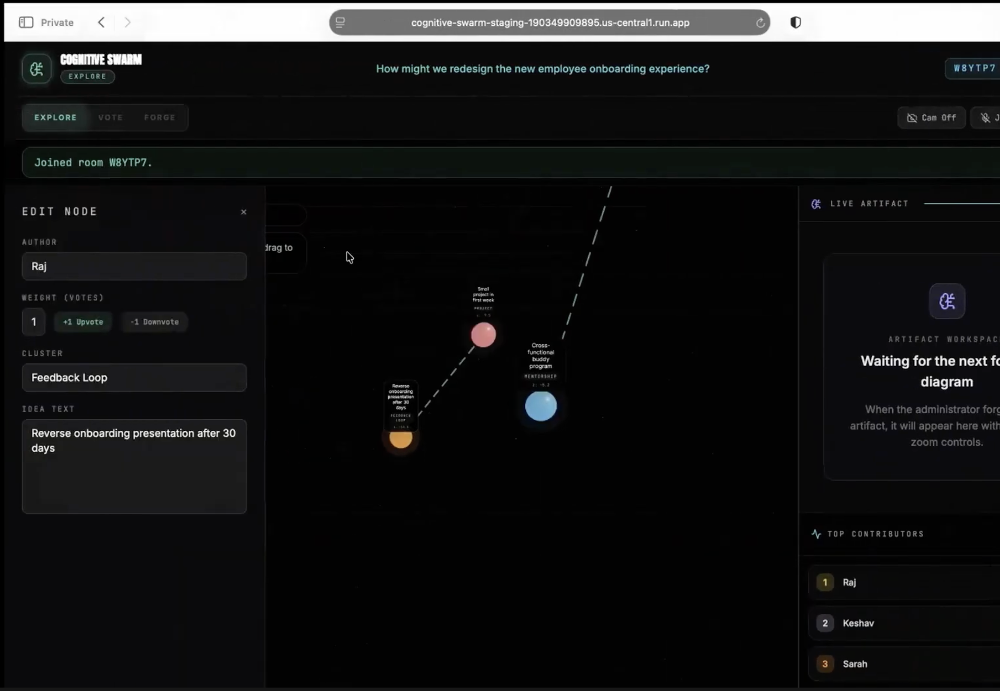
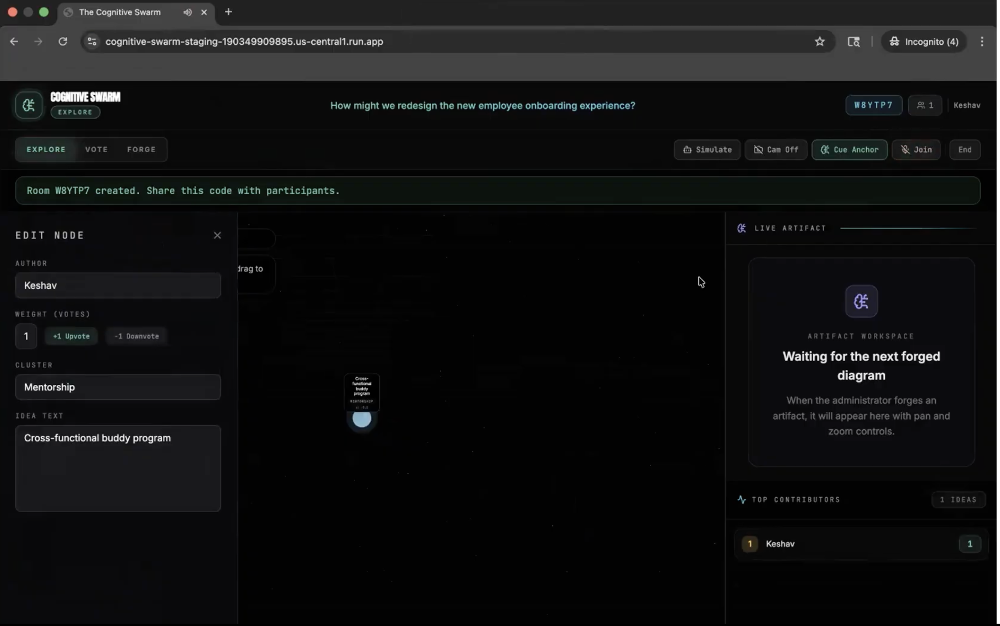
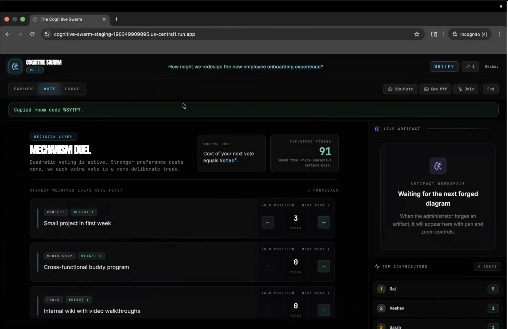
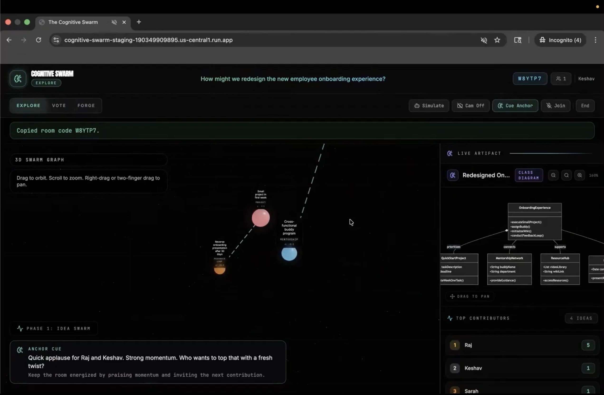

# The Cognitive Swarm

The Cognitive Swarm is a real-time, multimodal brainstorming application built with React, Socket.IO, Express, Vite, and the Gemini API. An admin creates a room with a topic, participants join with a room code, and everyone ideates together — speaking ideas into the room while an AI anchor facilitates, extracts ideas from speech, and helps the group converge.

The app uses Gemini in two ways:
- **Gemini Live** for low-latency, full-duplex voice interaction with the anchor (listening, speaking, interruption-aware).
- **Gemini model calls** for idea research, connection synthesis, devil's advocate critiques, artifact generation, and embeddings.

## Screenshots

**Explore phase — 3D idea swarm** (multiple participants, ideas clustered by semantic similarity)



**Explore phase — idea detail panel** (admin editing a node; AI anchor cue visible at bottom)



**Vote phase — Mechanism Duel** (quadratic voting surfaces genuine group preference)



**Forge phase — generated artifact** (class diagram synthesized from top-weighted ideas)



## Core Capabilities

- Room-based sessions with admin/participant roles and 6-character room codes
- Live anchor voice that answers questions, praises contributors, nudges quiet participants, and challenges groupthink
- Real-time audio and video streaming into Gemini Live
- Automatic idea extraction from natural speech via tool calling
- 3D idea swarm visualization where proximity reflects semantic similarity (Gemini embeddings)
- Background agents: synthesizer (discovers connections), devil's advocate (challenges ideas), direction suggester (prompts exploration)
- Quadratic voting during convergence for fair consensus
- Topic-aware Mermaid artifact generation (flowchart, mindmap, erDiagram, classDiagram, journey)
- Persistent state via Redis + Firestore in production

## Architecture

Detailed architecture, runtime flow, and Gemini integration notes live in [docs/architecture.md](docs/architecture.md).

## Run Locally

### Prerequisites

- **Node.js 20–23** (checked automatically on startup)
- **npm**
- **A valid Gemini API key** — get one from [Google AI Studio](https://aistudio.google.com/apikey)
- **Chrome or Edge** recommended (requires WebSocket, AudioContext, microphone/camera access)

### Setup

1. Clone the repository:

```bash
git clone https://github.com/keshavdalmia10/the_cognitive_swarm.git
cd the_cognitive_swarm
```

2. Install dependencies:

```bash
npm install
```

3. Create a local environment file from the example:

```bash
cp .env.example .env
```

4. Set your Gemini key in `.env`:

```bash
GEMINI_API_KEY="your-gemini-api-key"
```

That's it for local development. The defaults in `.env.example` use in-memory state (no Redis or Firestore required).

### Start the app

```bash
npm run dev
```

Open the app in your browser at `http://127.0.0.1:3001`.

### How to use it

1. **Create a room**: Enter your display name and a brainstorming topic, then click "Create Room". You'll get a 6-character room code.
2. **Share the code**: Send the room code to participants. They enter the code and their name to join.
3. **Enable mic/camera**: Click the microphone button to start speaking. The AI anchor listens, responds, and extracts ideas from your speech into the 3D swarm. Camera is optional.
4. **Explore phase**: Ideas appear in the 3D swarm. The synthesizer discovers connections (edges), the devil's advocate posts critiques, and the direction suggester nudges the conversation when it stalls.
5. **Vote phase**: The admin transitions to the Vote phase. Participants allocate credits using quadratic voting — each additional vote on the same idea costs more, surfacing genuine group preference.
6. **Forge phase**: The admin transitions to the Forge phase. The top-weighted ideas are synthesized into a Mermaid diagram. The diagram type is automatically inferred from the topic.

### Verification

Run the checks:

```bash
npm test
npm run lint
```

Check server health:

```bash
curl http://127.0.0.1:3001/api/health
```

Expected response:

```json
{"status":"ok"}
```

## Environment Variables

All variables are documented in `.env.example`. For local development only `GEMINI_API_KEY` is required.

| Variable | Default | Description |
|----------|---------|-------------|
| `GEMINI_API_KEY` | *(required)* | Gemini API key for all AI calls |
| `PORT` | `3001` | Server port |
| `APP_ENV` | `development` | Namespace for session state and persistence |
| `DEFAULT_ROOM_ID` | `main-room` | Shared room identifier |
| `ALLOW_IN_MEMORY_STATE` | `true` | Allow in-memory state (set `false` in production) |
| `REDIS_URL` | *(unset)* | Redis connection URL (local development) |
| `REDIS_HOST` / `REDIS_PORT` | *(unset)* | Redis host and port (Cloud Run with Memorystore) |
| `REDIS_PASSWORD` | *(unset)* | Redis auth password |
| `REDIS_TLS` | `false` | Enable TLS for Redis connection |
| `REQUIRE_REDIS` | `false` | Fail startup if Redis is unavailable |
| `REQUIRE_FIRESTORE` | `false` | Fail startup if Firestore is unavailable |
| `FIRESTORE_COLLECTION` | `cognitive_swarm_sessions` | Firestore collection name for durable persistence |

## Production Deployment

The app is deployed to Google Cloud Platform. Full infrastructure is defined as code.

### Build

```bash
npm run build          # Builds client (Vite) + server (TypeScript)
docker build -t the-cognitive-swarm .
```

### Infrastructure

All GCP resources are managed via Terraform in [`infra/terraform/`](infra/terraform/):
- **Cloud Run** — auto-scaled serverless container hosting
- **Memorystore Redis** — distributed session state + Socket.IO adapter
- **Cloud Firestore** — durable persistence and recovery
- **Secret Manager** — stores `GEMINI_API_KEY`
- **Artifact Registry** — container image storage
- **VPC Connector** — connects Cloud Run to Redis/Firestore

### CI/CD

GitHub Actions workflows automate the pipeline:
- [`.github/workflows/deploy.yml`](.github/workflows/deploy.yml) — build, push, and deploy to Cloud Run (staging → production)
- [`.github/workflows/terraform.yml`](.github/workflows/terraform.yml) — Terraform plan and apply

Production environment variables:

```bash
GEMINI_API_KEY=<from Secret Manager>
PORT=8080
APP_ENV=production
REQUIRE_REDIS=true
REQUIRE_FIRESTORE=true
ALLOW_IN_MEMORY_STATE=false
REDIS_HOST=<memorystore-ip>
REDIS_PORT=6379
FIRESTORE_COLLECTION=sessions
```

## Runtime Notes

- `npm run dev` starts the Express + Socket.IO server from `server.ts` with Vite middleware, so one process serves both the API/socket layer and the frontend.
- The browser will prompt for microphone permission when a participant starts audio.
- Camera streaming is optional and sends roughly one JPEG frame per second into the Gemini Live session.
- In production, Socket.IO uses a Redis adapter for cross-instance message routing, enabling horizontal scaling.
- If the admin's connection drops, a 15-second grace period allows reconnection before the room closes.
- Maximum 200 ideas per room — the lowest-weight idea is auto-pruned when the limit is reached.
