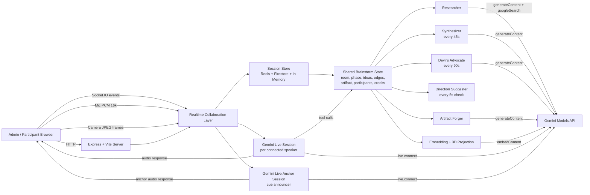
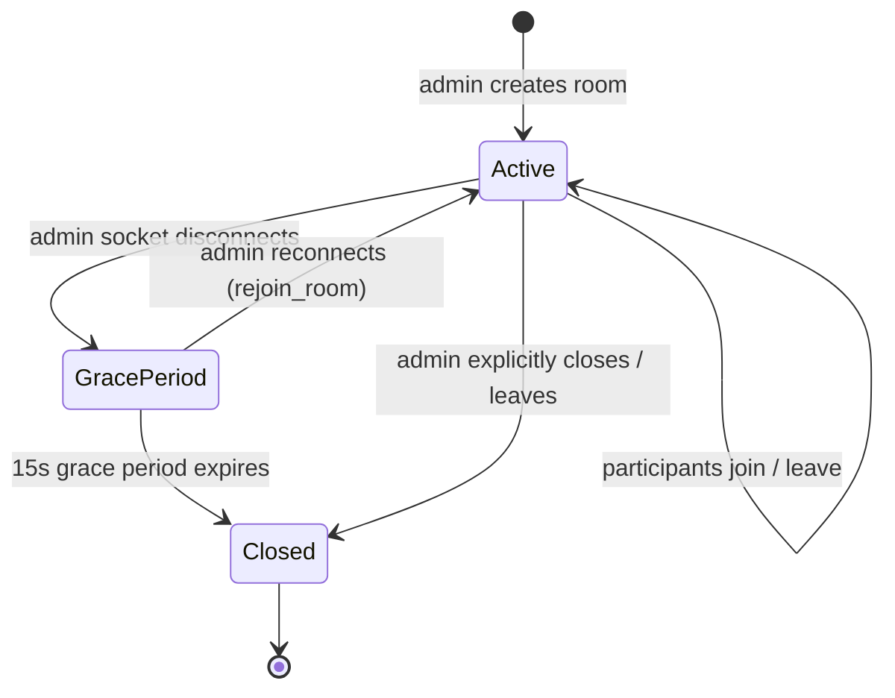
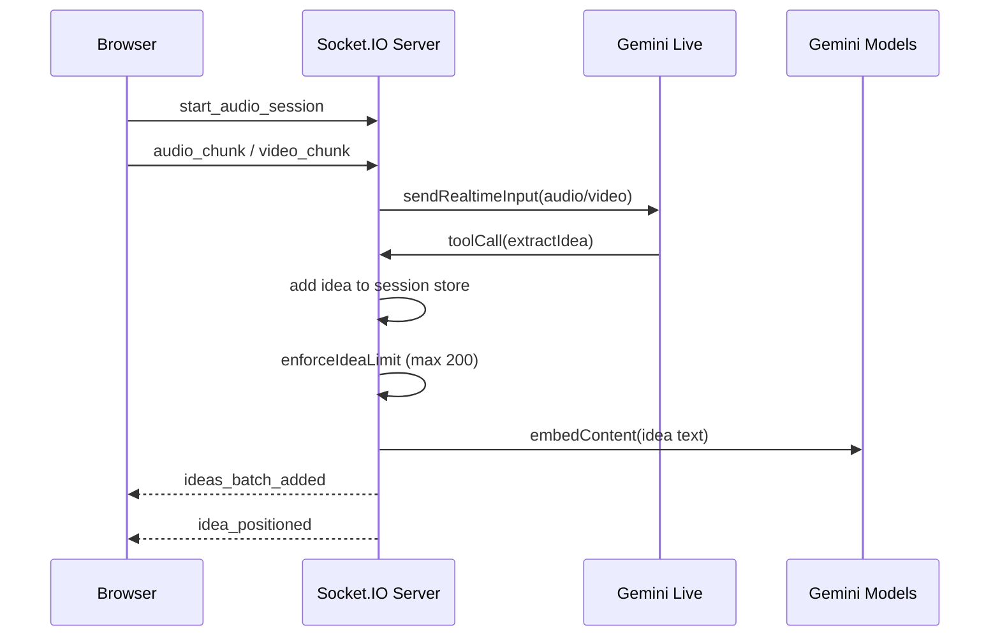
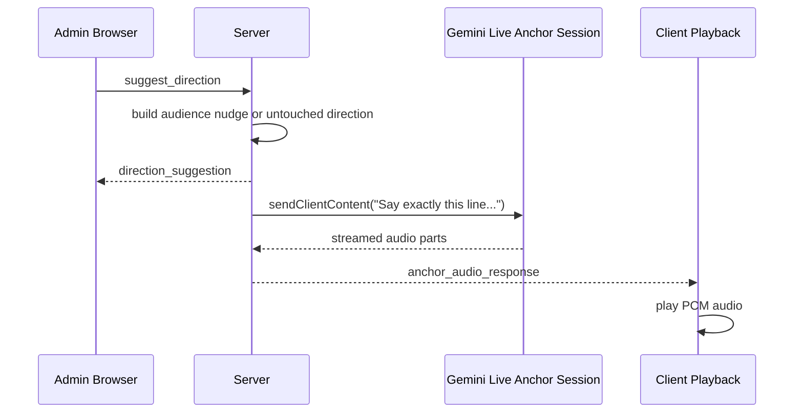
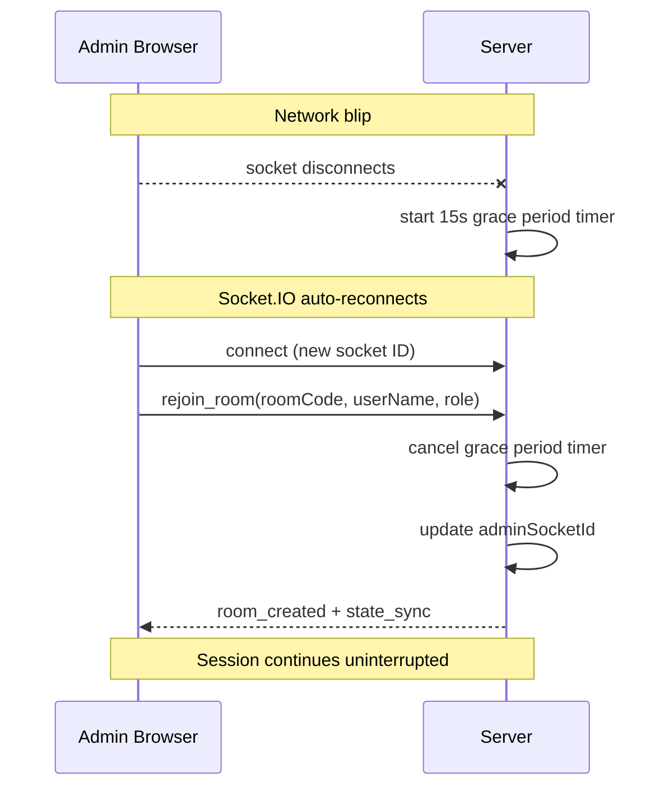

# Application Architecture

## Overview

The Cognitive Swarm is a single Node.js application that combines:
- an Express HTTP server,
- a Socket.IO real-time collaboration layer (with Redis adapter for multi-instance scaling),
- a Vite-served React frontend,
- Gemini Live sessions for conversational audio/video interaction,
- Gemini model calls for reasoning, search-backed research, embedding, and artifact generation,
- a room-based session model with admin/participant roles and structured brainstorming phases.

At runtime, the server owns the shared brainstorm state. The React client is a live view/controller over that state, and Gemini is used as an orchestration layer rather than a separate autonomous backend.

## High-Level Architecture



## Room-Based Session Model

Sessions are organized into rooms. An admin creates a room with a topic and receives a 6-character alphanumeric room code. Participants join by entering the code.

### Room lifecycle



### Roles

- **Admin**: Creates the room, controls phase transitions, can close the room. One admin per room, tracked by `adminSocketId`.
- **Participant**: Joins an existing room. Can contribute ideas, vote, and interact with the AI anchor.

### Room context

Each active room gets a `RoomContext` on the server:

```typescript
interface RoomContext {
  roomCode: string;
  store: SessionStore;                          // state persistence
  directionSuggestionInFlight: boolean;
  anchorLiveSessionPromise: Promise<any> | null; // shared anchor voice
  synthesizerInterval: NodeJS.Timeout | null;    // 45s edge discovery
  criticInterval: NodeJS.Timeout | null;         // 90s devil's advocate
  suggestionInterval: NodeJS.Timeout | null;     // 5s direction check
  runtimeEnabled: boolean;
}
```

Background agents (synthesizer, devil's advocate, direction suggester) start when the first participant registers and stop when all participants leave.

## Session Phases

Each room progresses through three structured phases:

| Phase | Name | Purpose |
|-------|------|---------|
| `divergent` | Explore | Free idea generation. Synthesizer discovers connections, devil's advocate challenges groupthink, direction suggester nudges quiet participants. |
| `convergent` | Vote | Quadratic voting. Participants allocate credits to signal preference. Higher cost per additional vote on the same idea prevents concentration of influence. |
| `forging` | Forge | Artifact generation. Top-weighted ideas are synthesized into a Mermaid diagram with the type (flowchart, mindmap, erDiagram, classDiagram, journey) inferred from the topic. |

Phase transitions are admin-controlled via the `set_phase` event.

## Main Runtime Pieces

### 1. Frontend client

Primary file: `src/App.tsx`

The React app is responsible for:
- creating or joining a room as admin or participant,
- maintaining socket subscriptions and auto-rejoining on reconnection,
- capturing microphone audio and sending PCM chunks (resampled to 16kHz),
- capturing camera frames and sending JPEG snapshots (~1fps),
- playing Gemini audio responses and anchor announcements,
- rendering the 3D swarm, voting UI, contributor leaderboard, and artifact canvas.

Related components:
- `src/components/IdeaSwarm.tsx` — 3D idea swarm visualization (React Three Fiber + Three.js)
- `src/components/ArtifactCanvas.tsx` — Mermaid diagram and flow-based artifact rendering (XYFlow)
- `src/components/IdeaVoting.tsx` — Quadratic voting interface with credit tracking

### 2. Realtime server

Primary file: `server.ts`

The server does five jobs:
- serves the frontend (Vite middleware in dev, static files in production),
- manages the Socket.IO collaboration protocol,
- owns the authoritative brainstorm state via `SessionStore`,
- brokers all Gemini requests (Live sessions and standard model calls),
- runs background intelligence agents per room.

### 3. State persistence

Primary file: `src/server/sessionStore.ts`
Configuration: `src/server/runtimeConfig.ts`

The `SessionStore` abstracts three storage backends behind a unified interface:

| Backend | Purpose | When used |
|---------|---------|-----------|
| **In-memory** | Fast, zero-setup state | Development (default), or fallback when Redis unavailable |
| **Redis** | Distributed shared state with transactional consistency (WATCH/MULTI/EXEC) | Production multi-instance deployments |
| **Firestore** | Durable persistence and recovery | Production; hydrates state on startup, persists after each mutation |

The store exposes:
- `getSnapshot()` — read current session state
- `mutate(fn)` — apply changes atomically, auto-persist to Redis/Firestore
- `removeParticipant(socketId)` — clean up on disconnect

Session state structure:

```typescript
SessionSnapshot {
  room: { code, adminSocketId, adminUserName, status, createdAt, updatedAt }
  state: { topic, phase, ideas[], edges[], flowData, artifactData }
  participants: { [socketId]: { userName, role, joinedAt, contributionCount,
                                credits, votes, lastContributionAt } }
  metadata: { lastIdeaTime, lastDirectionSuggestionTime, updatedAt }
}
```

### 4. Collaboration protocol

The app is event-driven. The browser emits actions and the server broadcasts updates.

**Client → Server events:**

| Category | Events |
|----------|--------|
| Room management | `create_room`, `join_room`, `rejoin_room`, `leave_room`, `close_room` |
| Participant | `register_participant` |
| Audio/Video | `start_audio_session`, `stop_audio_session`, `start_video_session`, `stop_video_session`, `audio_chunk`, `video_chunk`, `text_chunk` |
| Ideas | `add_idea`, `update_idea_embedding`, `update_idea_weight`, `edit_idea` |
| Artifact | `forge_artifact`, `update_flow` |
| Session control | `set_topic`, `set_phase`, `suggest_direction`, `interrupt_anchor` |

**Server → Client events:**

| Category | Events |
|----------|--------|
| Room lifecycle | `room_created`, `room_joined`, `room_left`, `room_closed`, `room_error` |
| State sync | `state_sync`, `topic_updated`, `phase_changed`, `flow_updated` |
| Ideas | `ideas_batch_added`, `ideas_batch_updated`, `idea_positioned`, `idea_researched`, `idea_weight_updated` |
| Edges | `edges_updated` |
| Audio | `audio_response`, `audio_session_started`, `audio_session_closed`, `audio_interrupted`, `anchor_audio_response`, `anchor_audio_interrupted` |
| Artifact | `artifact_updated`, `update_mermaid` |
| Suggestions | `direction_suggestion` |
| Credits | `credits_updated` |
| Errors | `error`, `room_error` |

## Quadratic Voting

Implementation: `src/utils/serverGuards.ts`, `src/components/IdeaVoting.tsx`

Each participant starts with **100 credits**. The cost of voting follows the quadratic formula:

```
cost = newVotes² − currentVotes²
```

This means: 1st vote costs 1, 2nd costs 3 (total 4), 3rd costs 5 (total 9), etc. The escalating cost discourages concentrating all influence on a single idea and surfaces genuine collective preference.

The server validates every vote against the participant's remaining credits before applying it.

## How Gemini Live Is Used

Gemini Live is integrated in two distinct modes.

### A. Per-user live conversation session

For each connected participant who starts audio or video, the server opens a Gemini Live session with `getAI().live.connect(...)`.

What goes into that session:
- audio chunks from `audio_chunk` as `audio/pcm;rate=16000`
- video frames from `video_chunk` as `image/jpeg`
- text turns from `text_chunk`

What comes out of that session:
- streamed audio response chunks emitted to the browser as `audio_response`
- interruption signals emitted as `audio_interrupted`
- tool calls that the server resolves against local session state

That Live session is what makes the anchor conversational. It is not just text generation. It is a full duplex live channel that can:
- listen to participants,
- answer topic questions,
- extract ideas on the fly,
- refer to the current room state (topic, ideas, who's contributing, who's quiet),
- stop talking when interrupted.

### B. Dedicated anchor announcement session

The app also keeps a second Gemini Live session per room just for spoken cues such as:
- direction suggestions,
- automatic audience nudges (naming quiet participants),
- untouched-direction prompts.

This second session exists so anchor announcements use the same Gemini audio path as the conversational anchor, instead of browser text-to-speech.

Flow:
1. Server decides to broadcast a suggestion.
2. Server emits `direction_suggestion` text for the on-screen banner.
3. Server sends the exact spoken line into the dedicated anchor Live session.
4. The returned PCM audio is broadcast as `anchor_audio_response`.
5. The client plays that audio through its playback `AudioContext`.

This is why anchor cues are audible and interruptible.

## How Gemini Is Integrated In The Codebase

### Live session tool integration

Inside the per-user Gemini Live config, the server registers function declarations for:
- `extractIdea` — pulls an idea from participant speech and adds it to session state
- `generateMermaid` — creates a Mermaid diagram from current ideas
- `getIdeas` — retrieves the current set of brainstorm ideas
- `getSessionSnapshot` — returns topic, phase, top contributors, quiet participants

When Gemini issues a tool call:
- the server inspects `message.toolCall.functionCalls`,
- resolves the requested function against local state,
- mutates or reads the brainstorm data via `SessionStore`,
- sends the result back with `sendToolResponse(...)`.

This is the key integration pattern: Gemini does not directly write application state. The server remains the source of truth and applies model decisions through explicit tool handlers.

### Non-Live Gemini usage

The codebase also uses standard model calls outside Gemini Live:

- `generateContent(...)` for:
  - untouched direction suggestions,
  - artifact generation (with smart diagram type inference),
  - researcher lookups (with Google Search grounding),
  - synthesizer edge discovery,
  - devil's advocate critique prompts

- `embedContent(...)` for:
  - generating 3072-dimensional embeddings for ideas,
  - projecting ideas into 3D space via random projection matrix

### Why this split exists

Gemini Live is used where latency and turn-taking matter:
- speaking,
- listening,
- interruption,
- multimodal audio/video interaction.

Regular Gemini model calls are used where batch reasoning is better:
- summarization,
- structural synthesis,
- link discovery,
- artifact generation,
- embeddings.

## Background Intelligence Agents

The server runs three autonomous agents per active room:

| Agent | Interval | Purpose |
|-------|----------|---------|
| **Synthesizer** | Every 45 seconds | Discovers 1–2 strong connections between existing ideas. Adds edges to the swarm. Caps at 100 edges. |
| **Devil's Advocate** | Every 90 seconds | Generates a challenging question or counter-argument (5–10 words). Added as an idea with cluster "Critique" and weight 1.5. |
| **Direction Suggester** | Every 5 seconds (check) | Active only in divergent phase. Checks if session has been idle 30+ seconds. Builds audience nudges (naming quiet participants) or suggests unexplored directions. Deduplicates within a 2-minute window. |

All agents start when the first participant registers in a room and stop when the room is closed or all participants leave.

## Request / Event Flow

### Idea ingestion flow



### Anchor cue flow



### Admin reconnection flow



## Idea Management

- Maximum **200 ideas** per room. When the limit is reached, the idea with the lowest weight is automatically pruned.
- Ideas are batch-broadcast to reduce UI churn (`ideas_batch_added`).
- Positions are computed asynchronously via Gemini embeddings projected from 3072 dimensions into 3D using a random projection matrix.
- Fallback procedural positioning is used when embedding calls fail.
- Artifact rendering is client-side Mermaid rendering fed by server-produced Mermaid code. Diagram type is inferred from topic keywords and idea clusters.

## Infrastructure & Deployment

### Local development

#### Prerequisites

- Node.js 20+
- npm
- Gemini API key
- Browser microphone access

#### Steps

1. Install dependencies:

```bash
npm install
```

2. Create `.env`:

```bash
cp .env.example .env
```

3. Configure environment variables:

```bash
GEMINI_API_KEY="your-gemini-api-key"
PORT=3001
```

`PORT` is optional. If omitted, the server defaults to `3001`.

4. Start the application:

```bash
npm run dev
```

5. Open the app:

```text
http://127.0.0.1:3001
```

6. Optional validation:

```bash
npm test
npm run lint
curl http://127.0.0.1:3001/api/health
```

#### Development server behavior

In development, `server.ts` starts Express and mounts Vite middleware directly. That means:
- one process serves both backend and frontend,
- Socket.IO and the React app share the same origin,
- there is no separate frontend dev server to start,
- state defaults to in-memory (no Redis/Firestore required).

### Production deployment (GCP)

The application is deployed to Google Cloud Platform via a fully automated CI/CD pipeline.

#### Stack

| Component | Service | Purpose |
|-----------|---------|---------|
| Container runtime | Cloud Run | Auto-scaled serverless container hosting |
| Distributed state | Memorystore Redis | Shared session state + Socket.IO adapter |
| Durable persistence | Cloud Firestore | Session recovery and long-term storage |
| Secrets | Secret Manager | Stores `GEMINI_API_KEY` |
| Container registry | Artifact Registry | Stores Docker images |
| Networking | VPC Connector | Connects Cloud Run to Redis/Firestore |
| IaC | Terraform | Manages all GCP resources |
| CI/CD | GitHub Actions | Build → push → deploy pipeline with keyless Workload Identity Federation |

#### Docker

Multi-stage build (`Dockerfile`):
1. **Build stage**: Compiles TypeScript, builds React via Vite, prunes `node_modules`.
2. **Runtime stage**: Node 22 slim image with production dependencies only. Exposed on port 8080.

#### CI/CD pipeline

GitHub Actions workflow (`deploy.yml`):
1. **Validate**: Type-check and lint.
2. **Build**: Docker build and push to Artifact Registry.
3. **Deploy staging**: Deploy to Cloud Run staging with smoke test on `/api/health`.
4. **Deploy production**: Deploy to Cloud Run production.

#### Environment variables (production)

```bash
GEMINI_API_KEY          # from Secret Manager
PORT=8080
APP_ENV=production
REQUIRE_REDIS=true
REQUIRE_FIRESTORE=true
ALLOW_IN_MEMORY_STATE=false
REDIS_HOST=<memorystore-ip>
REDIS_PORT=6379
FIRESTORE_COLLECTION=sessions
```

#### Scaling

- Cloud Run instances are stateless; all shared state lives in Redis.
- Socket.IO Redis adapter handles cross-instance message routing.
- Firestore provides eventual consistency and recovery.
- Horizontal scaling requires no architectural changes.
