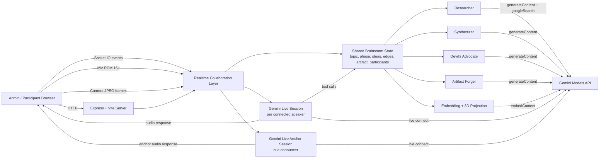
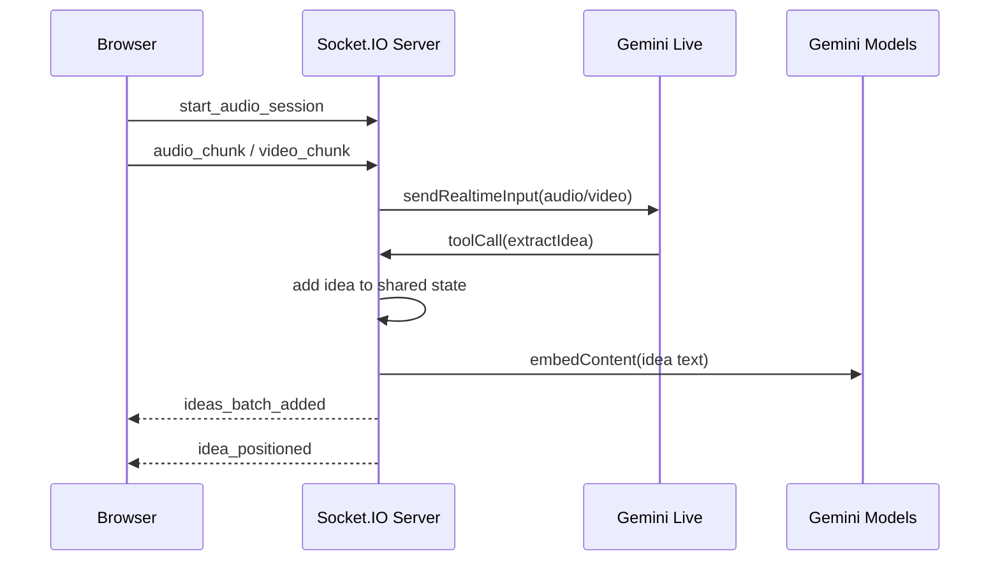
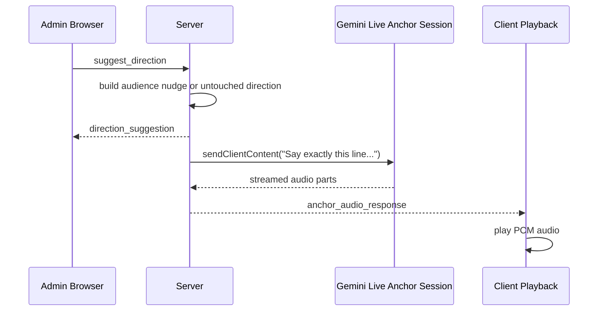

# Application Architecture

## Overview

The Cognitive Swarm is a single Node.js application that combines:
- an Express HTTP server,
- a Socket.IO real-time collaboration layer,
- a Vite-served React frontend,
- Gemini Live sessions for conversational audio/video interaction,
- Gemini model calls for reasoning, search-backed research, embedding, and artifact generation.

At runtime, the server owns the shared brainstorm state. The React client is a live view/controller over that state, and Gemini is used as an orchestration layer rather than a separate autonomous backend.

## High-Level Architecture



## Main Runtime Pieces

### 1. Frontend client

Primary file: [src/App.tsx](/Users/keshavdalmia/Documents/the_cognitive_swarm/src/App.tsx)

The React app is responsible for:
- joining a session as admin or participant,
- maintaining socket subscriptions,
- capturing microphone audio and sending PCM chunks,
- capturing camera frames and sending JPEG snapshots,
- playing Gemini audio responses,
- rendering the 3D swarm, voting UI, contributor leaderboard, and artifact canvas.

Related components:
- [src/components/IdeaSwarm.tsx](/Users/keshavdalmia/Documents/the_cognitive_swarm/src/components/IdeaSwarm.tsx)
- [src/components/ArtifactCanvas.tsx](/Users/keshavdalmia/Documents/the_cognitive_swarm/src/components/ArtifactCanvas.tsx)
- [src/components/IdeaVoting.tsx](/Users/keshavdalmia/Documents/the_cognitive_swarm/src/components/IdeaVoting.tsx)

### 2. Realtime server

Primary file: [server.ts](/Users/keshavdalmia/Documents/the_cognitive_swarm/server.ts)

The server does four jobs:
- serves the frontend,
- manages the Socket.IO collaboration protocol,
- owns the authoritative brainstorm state,
- brokers all Gemini requests.

Shared in-memory state includes:
- `topic`
- `phase`
- `ideas`
- `edges`
- `artifactData`
- participant metadata used for anchor prompts and nudges

### 3. Collaboration model

The app is event-driven. The browser emits actions such as:
- `register_participant`
- `start_audio_session`
- `audio_chunk`
- `start_video_session`
- `video_chunk`
- `add_idea`
- `update_idea_weight`
- `edit_idea`
- `forge_artifact`
- `suggest_direction`

The server broadcasts updates such as:
- `state_sync`
- `ideas_batch_added`
- `ideas_batch_updated`
- `idea_positioned`
- `idea_researched`
- `edges_updated`
- `artifact_updated`
- `direction_suggestion`
- `audio_response`
- `anchor_audio_response`

## How Gemini Live Is Used

Gemini Live is integrated in two distinct modes.

### A. Per-user live conversation session

Code path: [server.ts](/Users/keshavdalmia/Documents/the_cognitive_swarm/server.ts)

For each connected participant who starts audio or video, the server opens a Gemini Live session with `getAI().live.connect(...)`.

What goes into that session:
- audio chunks from `audio_chunk` as `audio/pcm;rate=16000`
- video frames from `video_chunk` as `image/jpeg`
- text turns from `text_chunk`

What comes out of that session:
- streamed audio response chunks emitted to the browser as `audio_response`
- interruption signals emitted as `audio_interrupted`
- tool calls that the server resolves against local session state

That Live session is what makes the anchor conversational. It is not just text generation. It is a full duplex live channel that can:
- listen to participants,
- answer topic questions,
- extract ideas,
- refer to the current room state,
- stop talking when interrupted.

### B. Dedicated anchor announcement session

Code path: [server.ts](/Users/keshavdalmia/Documents/the_cognitive_swarm/server.ts)

The app also keeps a second Gemini Live session just for spoken cues such as:
- `Cue Anchor`
- automatic audience nudges
- untouched-direction prompts

This second session exists so anchor announcements use the same Gemini audio path as the conversational anchor, instead of browser text-to-speech.

Flow:
1. Server decides to broadcast a suggestion.
2. Server emits `direction_suggestion` text for the on-screen banner.
3. Server sends the exact spoken line into the dedicated anchor Live session.
4. The returned PCM audio is broadcast as `anchor_audio_response`.
5. The client plays that audio through its playback `AudioContext`.

This is why anchor cues are now audible and interruptible.

## How Gemini Is Integrated In The Codebase

### Live session tool integration

Inside the per-user Gemini Live config, the server registers function declarations for:
- `extractIdea`
- `generateMermaid`
- `getIdeas`
- `getSessionSnapshot`

When Gemini issues a tool call:
- the server inspects `message.toolCall.functionCalls`,
- resolves the requested function against local state,
- mutates or reads the in-memory brainstorm data,
- sends the result back with `sendToolResponse(...)`.

This is the key integration pattern: Gemini does not directly write application state. The server remains the source of truth and applies model decisions through explicit tool handlers.

### Non-Live Gemini usage

The codebase also uses standard model calls outside Gemini Live:

- `generateContent(...)` for:
  - untouched direction suggestions,
  - artifact generation,
  - researcher lookups,
  - synthesizer edge discovery,
  - devil's advocate critique prompts

- `embedContent(...)` for:
  - generating embeddings for ideas,
  - projecting ideas into 3D space for the swarm graph

### Why this split exists

Gemini Live is used where latency and turn-taking matter:
- speaking,
- listening,
- interruption,
- multimodal audio/video interaction.

Regular Gemini model calls are used where batch reasoning is better:
- summarization,
- structural synthesis,
- link discovery,
- artifact generation,
- embeddings.

## Request / Event Flow

### Idea ingestion flow



### Anchor cue flow



## Local Development Setup

### Prerequisites

- Node.js 20+
- npm
- Gemini API key
- Browser microphone access

### Steps

1. Install dependencies:

```bash
npm install
```

2. Create `.env`:

```bash
cp .env.example .env
```

3. Configure environment variables:

```bash
GEMINI_API_KEY="your-gemini-api-key"
PORT=3001
```

`PORT` is optional. If omitted, the server defaults to `3001`.

4. Start the application:

```bash
npm run dev
```

5. Open the app:

```text
http://127.0.0.1:3001
```

6. Optional validation:

```bash
npm test
npm run lint
curl http://127.0.0.1:3001/api/health
```

### Development server behavior

In development, `server.ts` starts Express and mounts Vite middleware directly. That means:
- one process serves both backend and frontend,
- Socket.IO and the React app share the same origin,
- there is no separate frontend dev server to start.

## Notable Implementation Details

- State is currently in-memory only. Restarting the server resets the session.
- The server batches idea and idea-update broadcasts to reduce UI churn.
- Camera streaming is lightweight: the client captures a compressed JPEG approximately once per second.
- Idea positions are based on Gemini embeddings projected into 3D, then rendered in React Three Fiber.
- Artifact rendering is client-side Mermaid rendering fed by server-produced Mermaid code.
